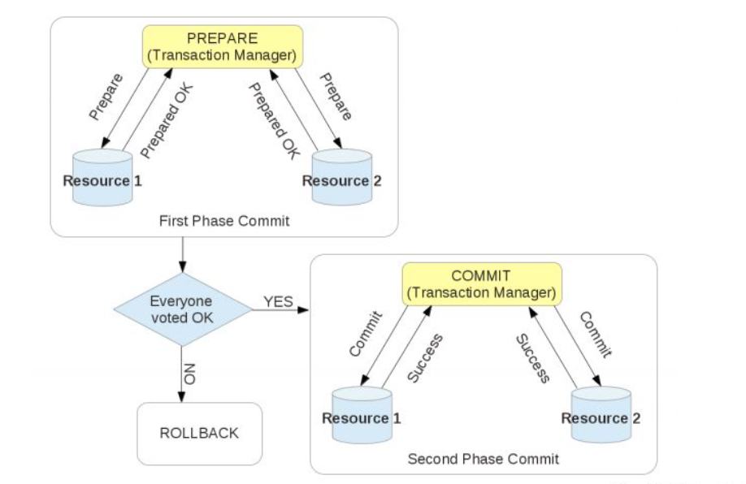

# 分布式事务

## 背景
在项目中，由于分库分表的原因，需要链接两个数据库，在mybatisplus的配置中配置了两个事务管理器，其中有一个类c，有个叫c1的方法，他会调用b类中b1方法和a类中a1方法，b1方法会调用第一个mysql的插入操作，同时加上trasanctional注解指定事务管理器为第一个的事务管理器，a1方法会调用第二个mysql的插入操作，同时加上trasanctional注解指定事务管理器为第二个的事务管理器，c1方法也会加上trasanctional注解，那么当a1调用失败时，b1并不会回滚。

这就引入了跨数据源事务的问题。

## 解决方案

### 2pc
分布式事务通常采用2PC协议，全称Two Phase Commitment Protocol。该协议主要为了解决在分布式数据库场景下，所有节点间数据一致性的问题。分布式事务通过2PC协议将提交分成两个阶段：

prepare；

commit/rollback

第一阶段 - 准备阶段：

协调者发送准备请求： 协调者向所有参与者发送准备请求，询问它们是否可以执行事务操作，并等待它们的响应。

参与者准备就绪： 参与者在收到准备请求后，进行本地事务的准备工作，如锁定资源、写入日志等，并向协调者发送准备就绪的消息。

协调者等待响应： 协调者收到所有参与者的准备就绪消息后，等待一段时间以确保所有参与者都已准备就绪。

第二阶段 - 提交阶段：

协调者发送提交请求： 如果协调者收到了所有参与者的准备就绪消息，它会向所有参与者发送提交请求，要求它们提交事务。

参与者执行提交操作： 参与者在收到提交请求后，正式执行事务提交操作，并释放相关资源。如果提交成功，参与者会向协调者发送提交成功的消息；如果提交失败，参与者会向协调者发送提交失败的消息。

协调者等待结果： 协调者收到所有参与者的提交结果后，根据结果决定是否将事务标记为提交或者回滚。如果所有参与者都提交成功，协调者将向应用程序返回提交成功的消息；如果有任何一个参与者提交失败或者超时未响应，协调者将向应用程序返回提交失败的消息，并要求所有参与者回滚事务。



## 具体实现
### XA引擎
```java
import com.atomikos.jdbc.AtomikosDataSourceBean;
import com.mysql.cj.jdbc.MysqlXADataSource;
import org.apache.ibatis.session.SqlSessionFactory;
import com.baomidou.mybatisplus.extension.spring.MybatisSqlSessionFactoryBean;
import org.mybatis.spring.SqlSessionTemplate;
import org.mybatis.spring.annotation.MapperScan;
import org.springframework.beans.factory.annotation.Qualifier;
import org.springframework.boot.context.properties.ConfigurationProperties;
import org.springframework.boot.jta.atomikos.AtomikosDataSourceBean;
import org.springframework.context.annotation.Bean;
import org.springframework.context.annotation.Configuration;
import org.springframework.transaction.annotation.EnableTransactionManagement;

import javax.sql.DataSource;
import java.sql.SQLException;

@Configuration
@EnableTransactionManagement  // 开启事务管理
public class DataSourceConfig {

    // 第一个数据源配置
    @Configuration
    @MapperScan(basePackages = "com.example.mapper.db1", sqlSessionFactoryRef = "firstSqlSessionFactory")
    static class FirstDataSourceConfig {

        @Bean(name = "firstDataSource")
        @ConfigurationProperties(prefix = "first-datasource")  // 绑定配置文件中的first-datasource
        public DataSource firstDataSource() throws SQLException {
            // 使用Atomikos包装XA数据源
            AtomikosDataSourceBean dataSource = new AtomikosDataSourceBean();
            MysqlXADataSource xaDataSource = new MysqlXADataSource();
            // 从配置中读取XA属性（url、user、password等）
            xaDataSource.setUrl("jdbc:mysql://localhost:3306/db1?useUnicode=true&characterEncoding=utf8&serverTimezone=UTC");
            xaDataSource.setUser("root");
            xaDataSource.setPassword("123456");
            dataSource.setXaDataSource(xaDataSource);
            dataSource.setUniqueResourceName("firstDB");  // 与配置文件中一致
            return dataSource;
        }

        @Bean(name = "firstSqlSessionFactory")
        public SqlSessionFactory firstSqlSessionFactory(@Qualifier("firstDataSource") DataSource dataSource) throws Exception {
            MybatisSqlSessionFactoryBean factoryBean = new MybatisSqlSessionFactoryBean();
            factoryBean.setDataSource(dataSource);
            // 若有MyBatis配置（如mapper.xml路径），需在此设置
            return factoryBean.getObject();
        }

        @Bean(name = "firstSqlSessionTemplate")
        public SqlSessionTemplate firstSqlSessionTemplate(@Qualifier("firstSqlSessionFactory") SqlSessionFactory sqlSessionFactory) {
            return new SqlSessionTemplate(sqlSessionFactory);
        }
    }

    // 第二个数据源配置（与第一个类似）
    @Configuration
    @MapperScan(basePackages = "com.example.mapper.db2", sqlSessionFactoryRef = "secondSqlSessionFactory")
    static class SecondDataSourceConfig {

        @Bean(name = "secondDataSource")
        @ConfigurationProperties(prefix = "second-datasource")
        public DataSource secondDataSource() throws SQLException {
            AtomikosDataSourceBean dataSource = new AtomikosDataSourceBean();
            MysqlXADataSource xaDataSource = new MysqlXADataSource();
            xaDataSource.setUrl("jdbc:mysql://localhost:3306/db2?useUnicode=true&characterEncoding=utf8&serverTimezone=UTC");
            xaDataSource.setUser("root");
            xaDataSource.setPassword("123456");
            dataSource.setXaDataSource(xaDataSource);
            dataSource.setUniqueResourceName("secondDB");
            return dataSource;
        }

        @Bean(name = "secondSqlSessionFactory")
        public SqlSessionFactory secondSqlSessionFactory(@Qualifier("secondDataSource") DataSource dataSource) throws Exception {
            MybatisSqlSessionFactoryBean factoryBean = new MybatisSqlSessionFactoryBean();
            factoryBean.setDataSource(dataSource);
            return factoryBean.getObject();
        }

        @Bean(name = "secondSqlSessionTemplate")
        public SqlSessionTemplate secondSqlSessionTemplate(@Qualifier("secondSqlSessionFactory") SqlSessionFactory sqlSessionFactory) {
            return new SqlSessionTemplate(sqlSessionFactory);
        }
    }
}
```

