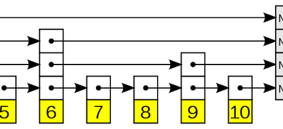

# Redis中的数据结构
## 有序集合
在redis中，还有一个特殊的数据结构，就是有序集合，有序集合是一个很重要的数据结构

和之前的数据结构不同，zset的定义在server.h

```c
typedef struct zset {
    dict *dict;
    zskiplist *zsl;
} zset;
```

由数据结构的定义来看，zset是由dict和zskiplist两种数据结构组合而成。因此通过数据结构的自身的性质来说，dict提供了O(1)的单点查询效率和O(logN)+M的范围查询效率

### skiplist

跳表是一种多重链表的数据数据结构



在redis中的跳表的定义如下

```c
/* ZSETs use a specialized version of Skiplists */
typedef struct zskiplistNode {
    sds ele;
    double score;
    struct zskiplistNode *backward;
    struct zskiplistLevel {
        struct zskiplistNode *forward;
        unsigned long span;
    } level[];
} zskiplistNode;
```

在跳表中保存了两个数据字段，一个是sds类型的ele，就是元素本身，另一个是double类型的数据权重score，同时跳表是一个双向链表，使用backward来保存了前一个节点，只记录了level0上的前一个节点，zskiplistLevel是一个结构体，对应了跳表的每一层，其中span对应了跨越了level0上个数

### zset操作
#### 查询

在redis中查询时可以直接读取dict中保存的score

```c
int zsetScore(robj *zobj, sds member, double *score) {
    if (!zobj || !member) return C_ERR;

    if (zobj->encoding == OBJ_ENCODING_LISTPACK) {
        if (zzlFind(zobj->ptr, member, score) == NULL) return C_ERR;
    } else if (zobj->encoding == OBJ_ENCODING_SKIPLIST) {
        zset *zs = zobj->ptr;
        dictEntry *de = dictFind(zs->dict, member);
        if (de == NULL) return C_ERR;
        *score = *(double*)dictGetVal(de);
    } else {
        serverPanic("Unknown sorted set encoding");
    }
    return C_OK;
}
```
#### 跳表操作

在zset中有很多函数都包含对跳表的操作，包括` zslInsert`,`zslDelete`,`zslUpdateScore`,`zslNthInRange`等函数，

```c
 x = zsl->header;
    for (i = zsl->level-1; i >= 0; i--) {
        while (x->level[i].forward &&
                (x->level[i].forward->score < curscore ||
                    (x->level[i].forward->score == curscore &&
                     sdscmp(x->level[i].forward->ele,ele) < 0)))
        {
            x = x->level[i].forward;
        }
        ///update[i] = x;
    }
```
这是一段公共代码，这些函数都有这段代码，这是对跳表进行查询的步骤，包含下面的部分

* 当查找到的结点保存的元素权重，比要查找的权重小时，跳表就会继续访问该层上的下一个结点。

* 当查找到的结点保存的元素权重，等于要查找的权重时，跳表会再检查该结点保存的 SDS 类型数据，是否比要查找的 SDS 数据小。如果结点数据小于要查找的数据时，跳表仍然会继续访问该层上的下一个结点。

* 当上述两个条件都不满足时，跳表就会用到当前查找到的结点的 level 数组了。跳表会使用当前结点 level 数组里的下一层指针，然后沿着下一层指针继续查找，这就相当于跳到了下一层接着查找。

#### 跳表自身属性
跳表的本质是多级链表，所以在构建链表的时候需要确定链表的层数

```c
int zslRandomLevel(void) {
    static const int threshold = ZSKIPLIST_P*RAND_MAX;
    int level = 1;
    while (random() < threshold)
        level += 1;
    return (level<ZSKIPLIST_MAXLEVEL) ? level : ZSKIPLIST_MAXLEVEL;
}
```
在 Redis 源码中，跳表结点层数是由 zslRandomLevel 函数决定。zslRandomLevel 函数会把层数初始化为 1，这也是结点的最小层数。然后，该函数会生成随机数，如果随机数的值小于 ZSKIPLIST_P（指跳表结点增加层数的概率，值为 0.25），那么层数就增加 1 层。因为随机数取值到`[0,0.25)` 范围内的概率不超过 25%，所以这也就表明了，每增加一层的概率不超过 25%。


### 小结
1、redis中的zset是一个组合型的数据结构，其中包含了哈希表dict和跳表

2、dict是针对单点查询，跳表是针对范围查询

3、跳表是一个多层的有序链表，在跳表中进行查询操作时，查询代码可以从最高层开始查询。层数越高，结点数越少，同时高层结点的跨度会比较大。因此，在高层查询结点时，查询一个结点可能就已经查到了链表的中间位置了。

这样一来，跳表就会先查高层，如果高层直接查到了等于待查元素的结点，那么就可以直接返回。如果查到第一个大于待查元素的结点后，就转向下一层查询。下层上的结点数多于上层，所以这样可以在更多的结点中进一步查找待查元素是否存在。

跳表的这种设计方法就可以节省查询开销，同时，跳表设计采用随机的方法来确定每个结点的层数，这样就可以避免新增结点时，引起结点连锁更新问题。


