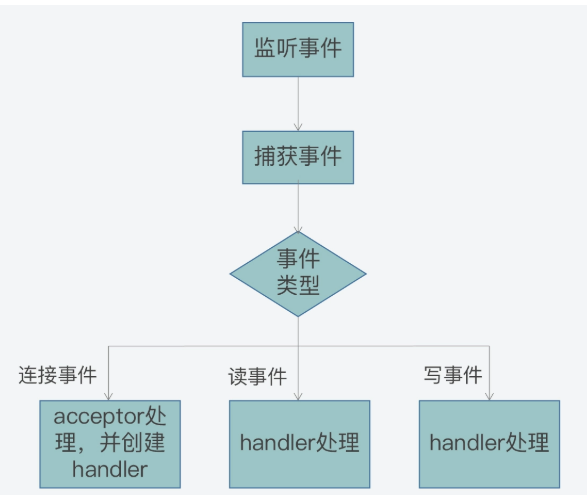

# Redis中的事件驱动框架

## 常见的模型
### Socket模型
在linux中，使用Socket模型来进行通信是一种常见的通信方式，包括网络通信和进程间通信都可以使用Scoket。

在使用Scoket进行通信时，首先需要创建一个套接字，将套接字绑定到ip和端口上，对绑定好的配置进行监听。最后调用accept函数进行接收。如果有新连接来处理连接请求，如果没有就阻塞，最后调用recv和send读或写缓冲区。

在这种模型下，每次都依次调用和处理连接，每次都只能处理一次，如果有大量的连接有请求需要处理，这种方式效率很低。如果想要并发的处理这些连接，就需要多线程来处理。将接收到的连接交个子线程来处理，但是实际上redis的主执行流程是一个线程在处理，对于上述的方式，在redis并不适用

### redis中的模型
#### io多路复用
实际上除了多线程，io多路复用也可以提高并发处理能力。使用io多路复用，可以让一个套接字监听多个连接。

 select是linux提供的三种io多路复用之一
 ```c
 int select (int __nfds, fd_set *__readfds, fd_set *__writefds, fd_set *__exceptfds, struct timeval *__timeout)
 ```
 nfds是监听的文件描述符数量，和三种不同事件，即读、写和异常事件对应的文件描述符集合，最后是超时时间。
 参数 readfds、writefds 和 exceptfds 的类型是 fd_set 结构体，它主要定义部分如下所示。其中，fd_mask类型是 long int 类型的别名，__FD_SETSIZE 和 __NFDBITS 这两个宏定义的大小默认为 1024 和 32。
 ```c
 typedef struct {
   …
   __fd_mask  __fds_bits[__FD_SETSIZE / __NFDBITS];
   …
} fd_set
```

 在linux提供的select函数中，在使用select时，会将需要监听的文件描述符加入到对应的集合中，每次都是遍历集合获取已经有事件发生的文件描述符，因此这会导致调用函数时的效率降低。同时select限制了文件描述符数量，导致监听的文件描述符数量有限

 poll是另一种io多路方式

 ```c
int poll (struct pollfd *__fds, nfds_t __nfds, int __timeout);
```
参数 *__fds 是 pollfd 结构体数组，参数 nfds 表示的是 *fds 数组的元素个数，而 __timeout 表示 poll 函数阻塞的超时时间。

```c
struct pollfd {
    int fd;         //进行监听的文件描述符
    short int events;       //要监听的事件类型
    short int revents;      //实际发生的事件类型
};
```
pollfd 结构体中包含了三个成员变量 fd、events 和 revents，分别表示要监听的文件描述符、要监听的事件类型和实际发生的事件类型。

在使用poll时，需要用监听的文件描述符和事件初始化pollfd结构体，再加入到数组中，最后再使用poll检查是否存在就绪的文件描述符

相较select，poll提供了一种通用的方式，不再使用发生的事件的方式来区分文件符，同时他取消的监听的文件描述符数目。但是仍需要去遍历数组来获取就绪的文件描述符

针对上述问题，Linux中还提供了一种方式就是epoll。
epoll提供了两种数据结构
```c
typedef union epoll_data
{
  ...
  int fd;  //记录文件描述符
  ...
} epoll_data_t;


struct epoll_event
{
  uint32_t events;  //epoll监听的事件类型
  epoll_data_t data; //应用程序数据
};
```
对于 epoll_event 结构体来说，其中包含了 epoll_data_t 联合体变量，以及整数类型的 events 变量。epoll_data_t 联合体中有记录文件描述符的成员变量 fd，而 events 变量会取值使用不同的宏定义值，来表示 epoll_data_t 变量中的文件描述符所关注的事件类型，比如一些常见的事件类型包括以下这几种。

* EPOLLIN：读事件，表示文件描述符对应套接字有数据可读。
* EPOLLOUT：写事件，表示文件描述符对应套接字有数据要写。
* EPOLLERR：错误事件，表示文件描述符对于套接字出错。

在select和poll中，保存需要监听的文件描述的数组需要自己创建，但是在epoll中，在初始化epoll以后，会自动创建数据结构来保存监听和就绪的文件描述符，底层使用红黑树来保存
* epoll 使用红黑树（RB-Tree）来存储所有被监听的文件描述符（fd）。
特点：
红黑树是一种平衡二叉搜索树，能够快速地插入、删除和查找文件描述符。
当调用 epoll_ctl 添加、修改或删除文件描述符时，epoll 会在红黑树中进行操作。
操作：
添加文件描述符：epoll_ctl(EPOLL_CTL_ADD) 会将文件描述符插入到红黑树中。
修改文件描述符：epoll_ctl(EPOLL_CTL_MOD) 会在红黑树中找到对应的文件描述符并更新其事件。
删除文件描述符：epoll_ctl(EPOLL_CTL_DEL) 会将文件描述符从红黑树中移除。

* epoll 使用一个双向链表队列来存储已就绪的文件描述符。
特点：
当某个文件描述符的事件触发时，epoll 会将其从红黑树中标记为就绪，并加入到就绪队列中。
就绪队列中的文件描述符会在调用 epoll_wait 时返回给用户。
操作：
当文件描述符的事件触发时，epoll 会将其加入到就绪队列中。
调用 epoll_wait 时，epoll 会从就绪队列中取出文件描述符并返回。

#### redis中的响应模式
reactor 模式

Reactor 模型就是网络服务器端用来处理高并发网络 IO 请求的一种编程模型。我把这个模型的特征用两个“三”来总结，也就是：

三类处理事件，即连接事件、写事件、读事件；
三个关键角色，即 reactor、acceptor、handler。

在redis中，为了提高在高并发时的处理能力，使用了reactor的模式来处理网络IO请求。

当有客户端发来连接请求的时候就对应来reactor中的连接事件。当客户端发来读请求的时候，服务端需要读取内容，就对应了读事件。处理完读事件给客户端返回时需要向缓冲区写数据，就对应了写事件。

在reactor模型中，acceptor是用来处理连接事件，读写事件是由相应的handler处理，而reactor是在高并发中将不同事件分给acceptor或者handler。

reactor模式的执行流程通常如下



