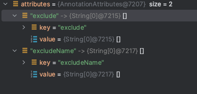
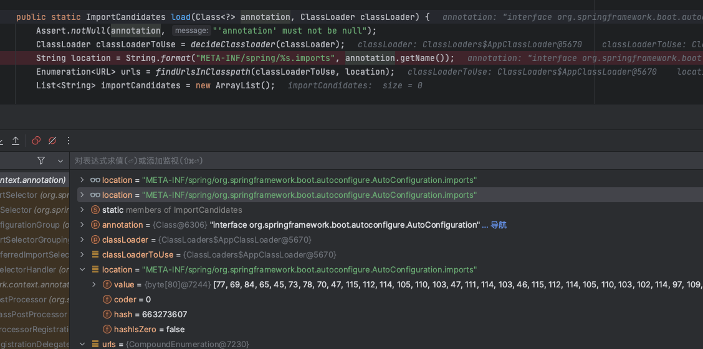

# Springboot 自动装配原理
## 背景
springboot源码阅读记录

## @SpringBootApplication 注解
在springboot启动的类中有一个注解，@SpringBootApplication 注解，查看这个注解的源码

```java
@Target({ElementType.TYPE})
@Retention(RetentionPolicy.RUNTIME)
@Documented
@Inherited
@SpringBootConfiguration
@EnableAutoConfiguration
@ComponentScan(
    excludeFilters = {@Filter(
    type = FilterType.CUSTOM,
    classes = {TypeExcludeFilter.class}
), @Filter(
    type = FilterType.CUSTOM,
    classes = {AutoConfigurationExcludeFilter.class}
)}
)
```
他内部又有多个其他的注解，其中比较重要的是：

    ComponentScan：扫描的包的路径
    SpringBootConfiguration：配置类
    EnableAutoConfiguration：开启自动装配功能

## @EnableAutoConfiguration注解

进入EnableAutoConfiguration注解看具体内容

```java
@Target({ElementType.TYPE})
@Retention(RetentionPolicy.RUNTIME)
@Documented
@Inherited
@AutoConfigurationPackage
@Import({AutoConfigurationImportSelector.class})
public @interface EnableAutoConfiguration {
    String ENABLED_OVERRIDE_PROPERTY = "spring.boot.enableautoconfiguration";

    Class<?>[] exclude() default {};

    String[] excludeName() default {};
}
```

先进入AutoConfigurationPackage注解
### @AutoConfigurationPackage注解

```java
static class Registrar implements ImportBeanDefinitionRegistrar, DeterminableImports {
        Registrar() {
        }

        public void registerBeanDefinitions(AnnotationMetadata metadata, BeanDefinitionRegistry registry) {
            AutoConfigurationPackages.register(registry, (String[])(new PackageImports(metadata)).getPackageNames().toArray(new String[0]));
        }

        public Set<Object> determineImports(AnnotationMetadata metadata) {
            return Collections.singleton(new PackageImports(metadata));
        }
    }
```
通过调试可以发现

在这里会根据你的application的包路径

```java
    public static void register(BeanDefinitionRegistry registry, String... packageNames) {
        if (registry.containsBeanDefinition(BEAN)) {
            addBasePackages(registry.getBeanDefinition(BEAN), packageNames);
        } else {
            RootBeanDefinition beanDefinition = new RootBeanDefinition(BasePackages.class);
            beanDefinition.setRole(2);
            addBasePackages(beanDefinition, packageNames);
            registry.registerBeanDefinition(BEAN, beanDefinition);
        }

    }
```
调用register注册registerBeanDefinition


### AutoConfigurationImportSelector

``` java
public class AutoConfigurationImportSelector implements DeferredImportSelector, BeanClassLoaderAware, ResourceLoaderAware, BeanFactoryAware, EnvironmentAware, Ordered 
```

```java
  public String[] selectImports(AnnotationMetadata annotationMetadata) {
        if (!this.isEnabled(annotationMetadata)) {
            return NO_IMPORTS;
        } else {
            AutoConfigurationEntry autoConfigurationEntry = this.getAutoConfigurationEntry(annotationMetadata);
            return StringUtils.toStringArray(autoConfigurationEntry.getConfigurations());
        }
    }
```
```java
 protected AutoConfigurationEntry getAutoConfigurationEntry(AnnotationMetadata annotationMetadata) {
        if (!this.isEnabled(annotationMetadata)) {
            return EMPTY_ENTRY;
        } else {
            AnnotationAttributes attributes = this.getAttributes(annotationMetadata);
            List<String> configurations = this.getCandidateConfigurations(annotationMetadata, attributes);
            configurations = this.removeDuplicates(configurations);
            Set<String> exclusions = this.getExclusions(annotationMetadata, attributes);
            this.checkExcludedClasses(configurations, exclusions);
            configurations.removeAll(exclusions);
            configurations = this.getConfigurationClassFilter().filter(configurations);
            this.fireAutoConfigurationImportEvents(configurations, exclusions);
            return new AutoConfigurationEntry(configurations, exclusions);
        }
    }
```

在这个函数中，首先会检查开关，是否可打开，然后检查

```java
    protected AnnotationAttributes getAttributes(AnnotationMetadata metadata) {
        String name = this.getAnnotationClass().getName();
        AnnotationAttributes attributes = AnnotationAttributes.fromMap(metadata.getAnnotationAttributes(name, true));
        Assert.notNull(attributes, () -> {
            String var10000 = metadata.getClassName();
            return "No auto-configuration attributes found. Is " + var10000 + " annotated with " + ClassUtils.getShortName(name) + "?";
        });
        return attributes;
    }
```


然后读取`META-INF/spring/org.springframework.boot.autoconfigure.AutoConfiguration.imports`下的导入类

```java
    public static ImportCandidates load(Class<?> annotation, ClassLoader classLoader) {
        Assert.notNull(annotation, "'annotation' must not be null");
        ClassLoader classLoaderToUse = decideClassloader(classLoader);
        String location = String.format("META-INF/spring/%s.imports", annotation.getName());
        Enumeration<URL> urls = findUrlsInClasspath(classLoaderToUse, location);
        List<String> importCandidates = new ArrayList();

        while(urls.hasMoreElements()) {
            URL url = (URL)urls.nextElement();
            importCandidates.addAll(readCandidateConfigurations(url));
        }

        return new ImportCandidates(importCandidates);
    }
```




最后还会有@ConditionalOnXXX的过滤，然后再进行加载
